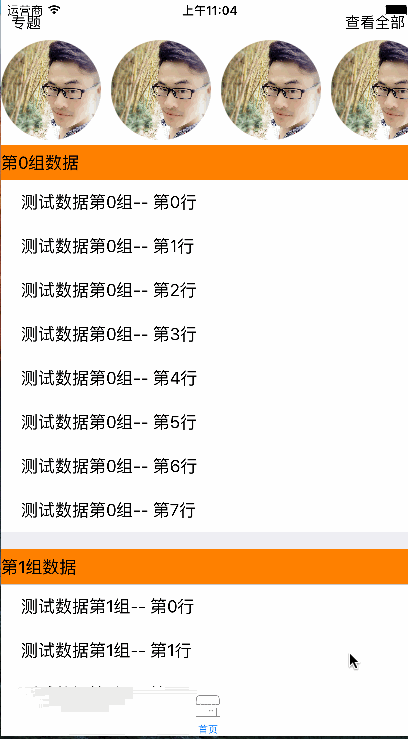

# tableHeaderView
> 今天我们来看看tableView的头部view,tableHeaderView和tableFooterView以及组View

- tableHeaderView,tableFooterView,组View这几种view的灵活运用可以实现很复杂的界面的布局效果
  - tableHeaderView为collectionView做下代码实现
  - 效果图(自行省略图片内容😂...)
  
  
 